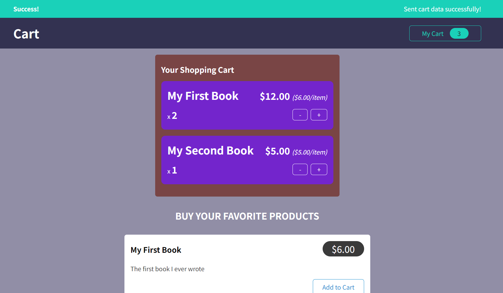

React Shopping Cart App
- This is a simple React app that allows you to add products to a shopping cart and manage the quantity and total price. You can also send the cart data to a Firebase backend and fetch it from there.

Features
- The app uses React hooks and custom components to create a user interface.
- The app uses Redux toolkit to manage the global state of the cart and the UI.
- The app uses Redux Thunk middleware to handle asynchronous actions such as sending and fetching data from Firebase.
- The app uses a custom notification component to display the status and error messages of the async actions.
How to run
- Clone the repository or download the zip file and extract it.
- Open a terminal and navigate to the project folder.
- Run npm install to install the dependencies.
- Run npm install react react-redux to install the dependencies.
- Run npm install @reduxjs/toolkit to install the dependencies.
- Run npm start to start the development server.
- Open your browser and go to http://localhost:3000 to see the app in action.

