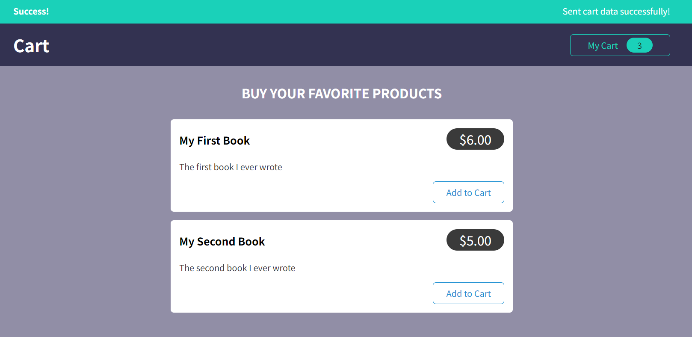

# React Shopping Cart App

This is a simple React app that allows you to add products to a shopping cart and manage the quantity and total price. You can also send the cart data to a Firebase backend and fetch it from there.

## Features

- The app uses React hooks and custom components to create a user interface.
- The app uses Redux toolkit to manage the global state of the cart and the UI.
- The app uses Redux Thunk middleware to handle asynchronous actions such as sending and fetching data from Firebase.
- The app uses a custom notification component to display the status and error messages of the async actions.

## How to run

- Clone this repository and run `npm install` to install the dependencies.
- Create a Firebase project and enable the Realtime Database feature.
- Copy the Firebase configuration object and paste it in the `src/firebase.js` file.
- Run `npm start` to start the development server and open the app in your browser.

